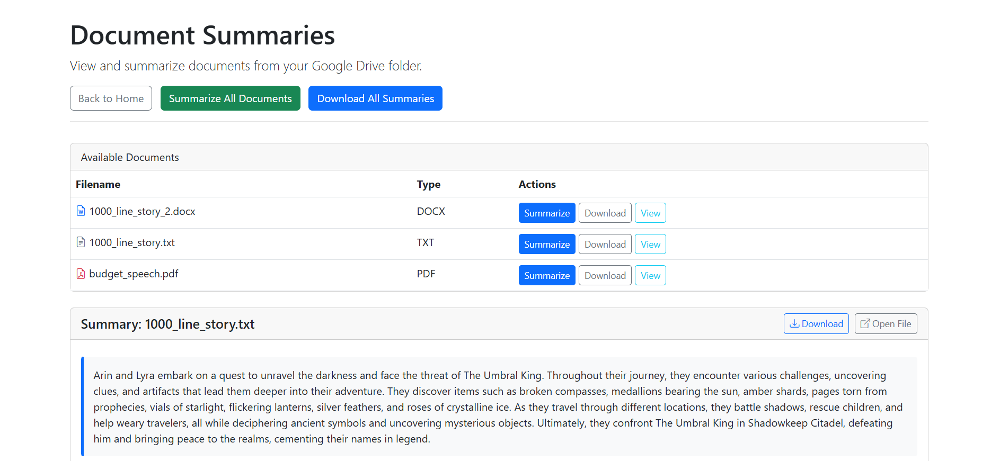

# Google Drive Document Summarizer

A web application that connects to your Google Drive, extracts text from documents (PDF, DOCX, TXT), and generates AI-powered summaries using OpenAI's GPT models.

## Features

- **Google Drive Integration**: Securely connect to your Google Drive account using OAuth2
- **Document Access**: Access documents from a specified Google Drive folder
- **Text Extraction**: Parse and extract text from PDFs, Word documents, and text files
- **AI Summarization**: Generate concise summaries using OpenAI's GPT-3.5
- **Export Options**: Download individual summaries or a complete report in CSV format
- **User-Friendly Interface**: Clean web interface built with Bootstrap

## Screenshot


## Requirements

- Python 3.8+
- Flask
- Google API client libraries
- OpenAI API key
- Google OAuth2 credentials

## Installation

1. Clone this repository:
   ```bash
   [git clone https://github.com/hritick99/document-summarizer.git]
   cd document-summarizer
   ```

2. Install required packages:
   ```bash
   pip install -r requirements.txt
   ```

3. Set up Google OAuth credentials:
   - Go to the [Google Cloud Console](https://console.cloud.google.com/)
   - Create a new project
   - Enable the Google Drive API
   - Create OAuth consent screen
   - Create OAuth 2.0 credentials
   - Download the credentials as `client_secret.json` and place in the root directory

4. Set environment variables:
   ```bash
   export FLASK_SECRET_KEY='your_secret_key'
   export OPENAI_API_KEY='your_openai_api_key'  
   export GOOGLE_DRIVE_FOLDER_ID='your_drive_folder_id'
   ```

## Usage

1. Start the application:
   ```bash
   python app.py
   ```

2. Open a web browser and navigate to `http://localhost:5000`

3. Click "Connect to Google Drive" and authorize the application

4. View available documents and generate summaries

## How It Works

1. **Authentication**: The app uses OAuth2 to securely connect to your Google Drive
2. **Document Listing**: Lists all documents from the specified folder
3. **Text Extraction**: When you select a document, the app:
   - Downloads the file from Google Drive
   - Extracts text based on file type (PDF, DOCX, TXT)
4. **Chunking**: For longer documents, the text is broken into manageable chunks
5. **Summarization**: OpenAI's GPT-3.5 generates a concise summary
6. **Display/Export**: Results are displayed on the web interface and can be exported as CSV

## Project Structure

```
document-summarizer/
├── app.py                # Main Flask application
├── client_secret.json    # Google OAuth credentials (not included)
├── requirements.txt      # Python dependencies
└── templates/
    ├── index.html        # Home page
    ├── files.html        # Document listing and summaries
    └── error.html        # Error page
```

## Text Processing Approach

- Documents are processed in chunks to handle large files
- For multi-chunk documents, each section is summarized individually and then combined into a coherent final summary
- Text extraction is optimized to maintain document structure where possible

## Limitations

- Currently supports PDF, DOCX, and TXT files only
- Limited to text-based content (images within documents are not processed)
- API rate limits may apply based on your OpenAI plan
- Google Drive API quota limitations may apply

## Future Improvements

- Support for additional file types (spreadsheets, presentations)
- Image text extraction using OCR
- More advanced summarization options (length, focus areas)
- Batch processing improvements for large document sets
- User-configurable folder selection

## License

This project is licensed under the [MIT License](LICENSE).

## Acknowledgements

- [OpenAI](https://openai.com/) for the GPT models
- [Google](https://developers.google.com/drive) for the Drive API
- [PyPDF2](https://pypdf2.readthedocs.io/) for PDF processing
- [python-docx](https://python-docx.readthedocs.io/) for DOCX processing
- [Flask](https://flask.palletsprojects.com/) for the web framework
- [Bootstrap](https://getbootstrap.com/) for the UI components
